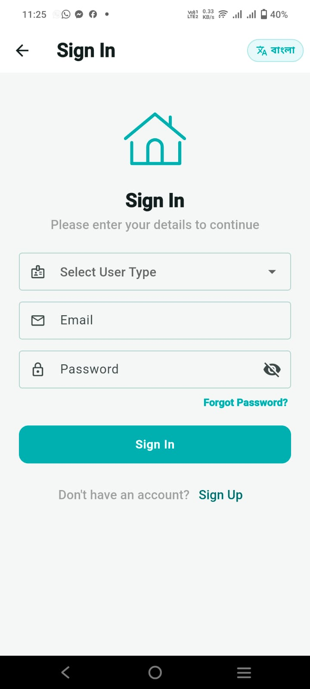
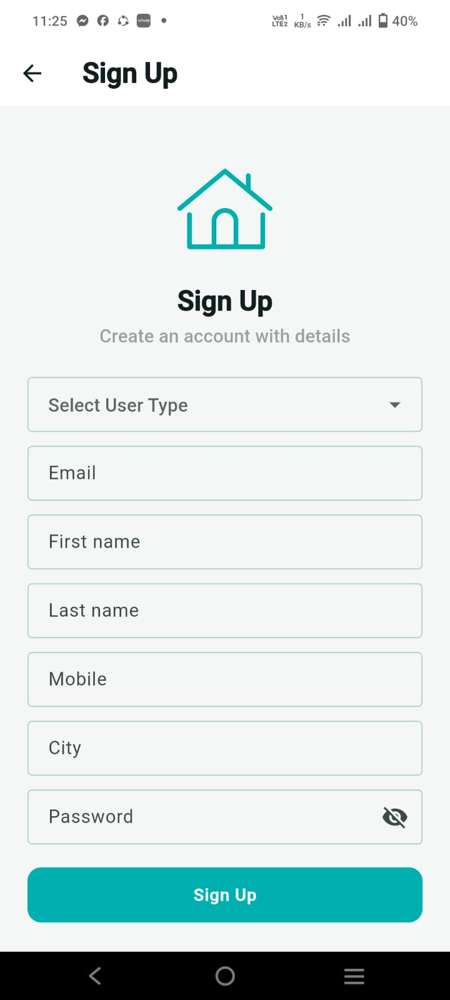

# 🏠 BashaBondhu (বাসাবন্ধু) — Smart Home Rental & Tenancy Management System

<p align="center">
  
</p>

<p align="center">
  <strong>An Enterprise-Grade, Broker-Free Digital Real Estate & Tenancy Ecosystem for Bangladesh</strong><br/>
  <em>Seamlessly connecting House Owners and Tenants with AI Guidance, OpenStreetMap Geolocation, NID KYC Verification & Verification Gating Control.</em>
</p>

<p align="center">
  
  
  
  
  
  
  
  
  
</p>

---

## 📑 Table of Contents

- [🌟 Executive Project Overview](#-executive-project-overview)
- [🚨 The Problem & The BashaBondhu Solution](#-the-problem--the-bashabondhu-solution)
- [🚀 Core Architectural Highlights & Innovations](#-core-architectural-highlights--innovations)
  - [1. Feature-First Clean Architecture](#1-feature-first-clean-architecture)
  - [2. Dual-Switch Verification Gating Engine](#2-dual-switch-verification-gating-engine)
  - [3. Client-Side Image Compression & Base64 Data URL Synchronization](#3-client-side-image-compression--base64-data-url-synchronization)
  - [4. Google Gemini 1.5 Flash AI Assistant with Cognitive Fallback](#4-google-gemini-15-flash-ai-assistant-with-cognitive-fallback)
  - [5. OpenStreetMap & Nominatim Geocoding Integration](#5-openstreetmap--nominatim-geocoding-integration)
  - [6. Digital Payments & Monetization via SSLCommerz](#6-digital-payments--monetization-via-sslcommerz)
- [👥 Role-Wise Feature Matrix](#-role-wise-feature-matrix)
  - [1. Guest User (Public Explorer)](#1-guest-user-public-explorer)
  - [2. Tenant (Renter / Flat-Seeker)](#2-tenant-renter--flat-seeker)
  - [3. House Owner (Landlord / Property Lister)](#3-house-owner-landlord--property-lister)
  - [4. Super Admin (Web Management Console)](#4-super-admin-web-management-console)
- [📸 Visual UI Showcase (All 50 Screenshots)](#-visual-ui-showcase-all-50-screenshots)
  - [1. Guest User & Authentication Showcase (4 Screenshots)](#1-guest-user--authentication-showcase)
  - [2. Tenant User Portal Showcase (Screens 5 – 24 | 20 Screenshots)](#2-tenant-user-portal-showcase-screens-5--24)
  - [3. House Owner Portal Showcase (Screens h1 – h16 | 16 Screenshots)](#3-house-owner-portal-showcase-screens-h1--h16)
  - [4. Super Admin Web Management Console (Screens a1 – a9 | 10 Screenshots)](#4-super-admin-web-management-console-screens-a1--a9)
- [📁 Folder & File Architecture](#-folder--file-architecture)
- [📦 Technology Stack, Packages & APIs](#-technology-stack-packages--apis)
- [🛠️ Installation & Local Setup Guide](#️-installation--local-setup-guide)
- [📍 Bangladesh Location Management Dataset](#-bangladesh-location-management-dataset)
- [🎓 Project Defense & Technical Q&A Cheat Sheet](#-project-defense--technical-qa-cheat-sheet)
- [📄 License & Authors](#-license--authors)

---

## 🌟 Executive Project Overview

**BashaBondhu (বাসাবন্ধু)** is a comprehensive, production-grade, multi-platform home rental and property management ecosystem engineered using **Flutter** and **Google Firebase Cloud Firestore**. 

In the bustling urban landscape of Bangladesh (particularly megacities like Dhaka, Chattogram, and Sylhet), both house seekers and landlords routinely grapple with exploitative intermediaries (*dalals*), fraudulent or outdated rental listings, unverified tenants, and security hazards. 

BashaBondhu completely eliminates the traditional middleman by establishing a transparent, verified, and intelligent digital bridge between **House Owners** and **Tenants**. Featuring front-and-back National ID (NID) KYC audits, dynamic verification gating, conversational voice & text AI assistance powered by Google Gemini 1.5 Flash, full OpenStreetMap geolocation, tiered subscriptions, and bilingual localization (English & বাংলা), BashaBondhu sets a new benchmark for PropTech solutions in South Asia.

---

## 🚨 The Problem & The BashaBondhu Solution

| Traditional Rental Market Pain Point | How BashaBondhu Solves It |
| :--- | :--- |
| **Middlemen / Broker Exploitation**: Dalals demand 50%–100% of the first month's rent just for showing addresses. | **Zero Middlemen**: Tenants contact landlords directly via one-tap direct phone calls and WhatsApp messaging. |
| **Security Risks & Fake Identities**: Landlords fear renting to unverified individuals without police/identity verification. | **NID KYC Verification Desk**: Front & back National ID documents verified by Super Admins before granting verified trust badges. |
| **Spam / Fake To-Let Posts**: Unverified listings cluttering search feeds and deceiving house seekers. | **Dual-Switch Verification Gating**: Admin toggle to restrict public visibility strictly to verified users and listings. |
| **High API Costs for Maps & Cloud Storage**: Costly Google Maps API keys and heavy storage buckets. | **OpenStreetMap + Base64 Sync**: 100% free OSM tiles + Nominatim geocoding combined with client-side Base64 image compression. |
| **Passive Waiting for Tenants**: Landlords post "To-Let" signs and wait weeks for calls. | **Tenant Demands Board**: Tenants post what flat they need, and house owners actively browse and reach out to them directly. |
| **Fragmented Pricing Knowledge**: Tenants unaware of standard market rates across specific sub-areas. | **Gemini 1.5 Flash AI Assistant**: Instant multi-turn advisory providing market rent estimates, legal tips, and search wizards. |

---

## 🚀 Core Architectural Highlights & Innovations

### 1. Feature-First Clean Architecture
The application adheres to a modular, feature-first Clean Architecture pattern under `lib/features/`. Each domain module encapsulates its own:
- **Presentation Layer**: Screen widgets, custom UI components, responsive layout handlers.
- **State Management Layer**: Provider pattern utilizing `ChangeNotifier`, `MultiProvider`, and reactive listeners for high performance and low memory footprint.
- **Data & Service Layer**: Cloud Firestore repositories, REST clients, and API communication logic.
- **Domain Models**: Strongly typed Dart models with bidirectional JSON parsing (`fromJson` / `toJson`) and null-safety guarantees.

### 2. Dual-Switch Verification Gating Engine
An enterprise-grade governance engine managed directly through the Super Admin Web Console:
- **Tenant Demands Gating Switch**: When activated, only verified tenants' demand posts are visible on the House Owner Demand board.
- **House Owner Properties Gating Switch**: When activated, only KYC-verified landlords' property posts appear in public search and home feeds.
- **Contextual In-App Warning Alerts**: When gating is active, unverified users receive real-time, non-intrusive warning banners on their `My Post` and `My Demand` screens explaining why their listings are currently hidden from public feeds and offering a one-tap link to complete their NID submission.

### 3. Client-Side Image Compression & Base64 Data URL Synchronization
To eliminate external cloud storage bucket fees, token expiry headaches, and cross-platform web CORS blocks:
- Picked images are downscaled and compressed client-side using `image_picker`.
- Images are encoded into Base64 Data URLs (`data:image/jpeg;base64,...`) and saved directly inside Firestore documents.
- Custom memory-cached image viewers (`AppImageWidget` & `FullScreenImageViewer`) provide instant multi-touch pinch-to-zoom, double-tap zoom, and panning across mobile and desktop browsers.

### 4. Google Gemini 1.5 Flash AI Assistant with Cognitive Fallback
- **Context-Aware System Instructions**: The AI assistant dynamically adapts its persona, vocabulary, and guidelines based on user role (`Tenant` vs `House Owner`) and app language (English vs বাংলা).
- **Structured JSON Intent Extraction**: Parses user queries into structured search criteria (e.g., bedrooms, budget, area) and presents clickable action chips in the chat.
- **Voice-Enabled Interface**: Integrates `speech_to_text` for hands-free voice search and `flutter_tts` for natural voice playback of assistant recommendations.
- **Offline Cognitive Fallback Engine**: If the Gemini REST API times out or quota is exceeded, an intelligent local rule-based heuristic engine (`_generateIntelligentBashaBondhuResponse`) seamlessly answers property questions, ensuring 100% service uptime.

### 5. OpenStreetMap & Nominatim Geocoding Integration
- Interactive, responsive map rendering powered by `flutter_map` and OpenStreetMap tile servers (`tile.openstreetmap.org`).
- Real-time address lookups and forward/reverse geocoding using the Nominatim API restricted to Bangladesh (`countrycodes=bd`).
- Interactive rooftop pin-dropping allowing landlords to drag and pinpoint exact coordinates with zero Google Maps billing overhead.

### 6. Digital Payments & Monetization via SSLCommerz
- Tiered subscription plans for both Tenants and House Owners.
- Integrated with Bangladesh's premier digital payment gateway **SSLCommerz**, enabling payments via **bKash, Nagad, Rocket, Upay, Visa, Mastercard, and Internet Banking**.
- Webview checkout flow with automated payment verification, Firestore subscription record updates, and expiry tracking.

---

## 👥 Role-Wise Feature Matrix

### 1. Guest User (Public Explorer)
* **Live Property Exploration**: Browse the newest verified apartments, bachelor sublets, family flats, and commercial spaces.
* **Smart Search & Filters**: Filter listings by Division, District, Upazila/Area, Sub-Area, Rent Budget range, and Bedroom count.
* **OpenStreetMap Map View**: View nearby properties plotted on an interactive map with clickable markers.
* **Photo Gallery**: Full-screen inspection of multi-angle property photos with pinch-to-zoom capabilities.
* **AI Assistance**: Query Gemini AI regarding rental market trends and moving tips without needing an account.
* **Auth-Gated Actions**: Non-intrusive redirection to Sign In / Sign Up only when attempting to bookmark, contact owners, or post demands.

### 2. Tenant (Renter / Flat-Seeker)
* **Personalized Home Feed**: Real-time stream of available rental properties with verified landlord trust badges.
* **17-Step To-Let Demand Posting Wizard**: Post specific accommodation requirements (rent budget, preferred area, bedrooms, bathrooms, move-in date, bachelor/family preference).
* **My Demands Management**: Complete CRUD control over personal demand posts with real-time active/inactive status toggles.
* **NID Identity Verification (KYC)**: Upload front & back National ID photos to obtain the verified tenant badge.
* **Wishlist & Bookmarking**: Save favorite flats for side-by-side comparison and quick access.
* **Direct Communication**: One-tap phone call or WhatsApp messaging directly to the property owner.
* **Voice AI Rental Assistant**: Voice input and text-to-speech audio reader for conversational flat-hunting guidance.
* **Subscription Management**: Access premium tenant features, unlimited contacts, and priority demand listings via SSLCommerz.

### 3. House Owner (Landlord / Property Lister)
* **Comprehensive Property Posting Wizard ("Post Free")**:
  - Upload up to 10 high-resolution photos with client-side compression.
  - Specify property type (Family, Bachelor, Sublet, Office/Commercial).
  - Monthly rent, service charges, advance security deposit, and available month.
  - Room specs (Bedrooms, Bathrooms, Balconies, Floor Number, Total Floors).
  - Dynamic amenities checklist (Lift, Generator, Gas, Parking, CCTV, Security Guard, WiFi).
  - OpenStreetMap location pinning with live address reverse geocoding.
* **My Posts Management**: Instant one-tap toggle between **"To-Let / Available"** and **"Rented Out / Inactive"**, plus editing and deletion.
* **Tenant Demands Discovery Board**: Proactively browse active tenant demands and contact interested renters directly.
* **Landlord KYC NID Verification**: Upload NID documents to earn the "Verified Landlord" badge and bypass admin gating filters.
* **Tiered Landlord Subscriptions**: Upgrade to Pro or Enterprise landlord packages to unlock higher active listing quotas and featured placement.

### 4. Super Admin (Web Management Console)
* **Executive KPI & Analytics Dashboard**: Real-time statistical metrics for Total Users, Active Properties, Demands, Revenue, and Pending KYC Audits.
* **User Management Directory**: Search, filter, inspect, and suspend/ban user accounts with full role toggles.
* **Automated KYC & NID Verification Desk**: Full-screen high-res zoom inspection of submitted Front & Back NID cards with one-tap Approve or Reject actions.
* **Dual-Switch Verification Gating Control**: Independently enforce verification-only visibility for Tenant Demands and Landlord Properties.
* **Property Oversight & Moderation**: Inspect all nationwide rental listings and remove spam or fraudulent content.
* **Subscription & Financial Ledger**: Track SSLCommerz transactions, package purchases, and subscription validity.
* **Location Database Manager**: Manage Bangladesh's geographic dataset (8 Divisions, 64 Districts, 550+ Areas, 5,000+ Sub-Areas) with live Firestore synchronization.
* **Dynamic Legal Policies & FAQs CMS**: Edit Terms & Conditions, Privacy Policy, Refund Policy, and FAQs directly from the web browser without app updates.
* **Vector PDF Reporting**: Generate and download printable management reports powered by `pdf` and `printing`.

---

## 📸 Visual UI Showcase (All 50 Screenshots)

### 1. Guest User & Authentication Showcase
*Public property discovery and secure authentication flows (4 mobile screenshots per row).*

<table>
  <tr>
    <td width="25%" align="center">
      
      <br/><sub><b>g1: Guest User Account Screen</b></sub>
    </td>
    <td width="25%" align="center">
      
      <br/><sub><b>g2: Guest User Home Screen</b></sub>
    </td>
    <td width="25%" align="center">
      
      <br/><sub><b>s1: Sign In Screen</b></sub>
    </td>
    <td width="25%" align="center">
      
      <br/><sub><b>s2: Sign Up & Role Selection</b></sub>
    </td>
  </tr>
</table>

---

### 2. Tenant User Portal Showcase (Screens 5 – 24)
*Complete tenant lifecycle: Property browsing, map exploration, demand posting, NID KYC verification, AI assistant, subscriptions, and legal records (Organized in 5 neat rows of 4).*

#### Row 1: Home Discovery, Details, Map Search & Area Filter
<table>
  <tr>
    <td width="25%" align="center">
      
      <br/><sub><b>5: Tenant Home Screen</b></sub>
    </td>
    <td width="25%" align="center">
      
      <br/><sub><b>6: Property Details Screen</b></sub>
    </td>
    <td width="25%" align="center">
      
      <br/><sub><b>7: OSM Nearby Map Search</b></sub>
    </td>
    <td width="25%" align="center">
      
      <br/><sub><b>8: Multi-Level Area Search</b></sub>
    </td>
  </tr>
</table>

#### Row 2: Demand Posting, Wishlist, Account Hub & KYC Verification
<table>
  <tr>
    <td width="25%" align="center">
      
      <br/><sub><b>9: Post To-Let Demand Screen</b></sub>
    </td>
    <td width="25%" align="center">
      
      <br/><sub><b>10: Saved Wishlist Screen</b></sub>
    </td>
    <td width="25%" align="center">
      
      <br/><sub><b>11: Tenant Account Screen</b></sub>
    </td>
    <td width="25%" align="center">
      
      <br/><sub><b>12: Profile & NID KYC Screen</b></sub>
    </td>
  </tr>
</table>

#### Row 3: Gemini AI Assistant, Subscription Packages & Payment Flow
<table>
  <tr>
    <td width="25%" align="center">
      
      <br/><sub><b>13: Gemini AI Voice Assistant</b></sub>
    </td>
    <td width="25%" align="center">
      
      <br/><sub><b>14: Subscription Tiers</b></sub>
    </td>
    <td width="25%" align="center">
      
      <br/><sub><b>15: Payment Method Selection</b></sub>
    </td>
    <td width="25%" align="center">
      
      <br/><sub><b>16: Subscription History</b></sub>
    </td>
  </tr>
</table>

#### Row 4: SSLCommerz Gateway, My Demands & Tenant Policies
<table>
  <tr>
    <td width="25%" align="center">
      
      <br/><sub><b>17: SSLCommerz Payment Gateway</b></sub>
    </td>
    <td width="25%" align="center">
      
      <br/><sub><b>18: My Demands (Gating Alert)</b></sub>
    </td>
    <td width="25%" align="center">
      
      <br/><sub><b>19: Tenant Privacy Policy</b></sub>
    </td>
    <td width="25%" align="center">
      
      <br/><sub><b>20: Tenant Support Policy</b></sub>
    </td>
  </tr>
</table>

#### Row 5: Legal Terms, Refunds, FAQs & Records
<table>
  <tr>
    <td width="25%" align="center">
      
      <br/><sub><b>21: Terms & Conditions Screen</b></sub>
    </td>
    <td width="25%" align="center">
      
      <br/><sub><b>22: Refund Policy Screen</b></sub>
    </td>
    <td width="25%" align="center">
      
      <br/><sub><b>23: Tenant FAQs Screen</b></sub>
    </td>
    <td width="25%" align="center">
      
      <br/><sub><b>24: My Records & Inquiries</b></sub>
    </td>
  </tr>
</table>

---

### 3. House Owner Portal Showcase (Screens h1 – h16)
*Landlord management lifecycle: Tenant demands board, posting flats with OSM pin, My Posts status toggles, landlord KYC, Gemini landlord advisor, subscriptions, and dark theme (Organized in 4 neat rows of 4).*

#### Row 1: Tenant Demands Feed, Demand Details, Post Free & My Posts
<table>
  <tr>
    <td width="25%" align="center">
      
      <br/><sub><b>h1: Tenant Demands Feed</b></sub>
    </td>
    <td width="25%" align="center">
      
      <br/><sub><b>h2: Demand Details & Direct Call</b></sub>
    </td>
    <td width="25%" align="center">
      
      <br/><sub><b>h3: Post Free (Listing Wizard)</b></sub>
    </td>
    <td width="25%" align="center">
      
      <br/><sub><b>h4: My Posts (Available/Rented)</b></sub>
    </td>
  </tr>
</table>

#### Row 2: Owner Account Hub, Landlord KYC, AI Advisor & Records
<table>
  <tr>
    <td width="25%" align="center">
      
      <br/><sub><b>h5: House Owner Account Screen</b></sub>
    </td>
    <td width="25%" align="center">
      
      <br/><sub><b>h6: Landlord KYC Verification</b></sub>
    </td>
    <td width="25%" align="center">
      
      <br/><sub><b>h7: Landlord Gemini AI Advisor</b></sub>
    </td>
    <td width="25%" align="center">
      
      <br/><sub><b>h8: Owner Records & Activity</b></sub>
    </td>
  </tr>
</table>

#### Row 3: Monetization Packages, History & Landlord Policies
<table>
  <tr>
    <td width="25%" align="center">
      
      <br/><sub><b>h9: Owner Subscription Packages</b></sub>
    </td>
    <td width="25%" align="center">
      
      <br/><sub><b>h10: Owner Subscription History</b></sub>
    </td>
    <td width="25%" align="center">
      
      <br/><sub><b>h11: Privacy Policy Screen</b></sub>
    </td>
    <td width="25%" align="center">
      
      <br/><sub><b>h12: Support Policy Screen</b></sub>
    </td>
  </tr>
</table>

#### Row 4: Terms, Refund, FAQs & Dark Theme Mode
<table>
  <tr>
    <td width="25%" align="center">
      
      <br/><sub><b>h13: Terms & Conditions Screen</b></sub>
    </td>
    <td width="25%" align="center">
      
      <br/><sub><b>h14: Refund Policy Screen</b></sub>
    </td>
    <td width="25%" align="center">
      
      <br/><sub><b>h15: House Owner FAQs</b></sub>
    </td>
    <td width="25%" align="center">
      
      <br/><sub><b>h16: Sleek Dark Theme Mode</b></sub>
    </td>
  </tr>
</table>

---

### 4. Super Admin Web Management Console (Screens a1 – a9)
*High-resolution desktop administrative screens (Organized with 1 full-width screenshot per row for optimal desktop clarity and deep technical capability breakdown).*

#### 🖥️ a1: Secure Administrative Authentication Gateway
<p align="center">
  
</p>

* **Implementation**: Built with Firebase Authentication and role-restricted security rules. Validates super-admin claims before rendering the web console.
* **Key Capabilities**: Encrypted session persistence, brute-force defense, and instant redirection to the Command Dashboard.

---

#### 🖥️ a2: Executive Command Center & Real-Time Analytics Dashboard
<p align="center">
  
</p>

* **Implementation**: Uses reactive Firestore `snapshots()` streams to aggregate platform metrics with zero server polling latency.
* **Key Capabilities**: Live KPI cards (Total Users, Active Properties, Demands, Revenue, Pending KYC), quick navigation links, and recent system audit alerts.

---

#### 🖥️ a3: Nationwide User Directory & NID KYC Verification Desk
<p align="center">
  
</p>

* **Implementation**: Paginated data grid with client-side search, role filters (`Tenant` vs `House Owner`), and a modal NID inspection viewer.
* **Key Capabilities**: High-res pinch-and-zoom inspection of Base64 Front and Back NID cards, instant one-tap **Approve / Reject** buttons, and immediate user account suspension/reactivation.

---

#### 🖥️ a4: Central Property Inventory & Content Moderation Portal
<p align="center">
  
</p>

* **Implementation**: Direct querying of the `properties` collection with multi-field search (title, owner, district, rent range).
* **Key Capabilities**: Complete listing inspection, status toggles (Approved, Flagged, Rented Out), photo gallery verification, and administrative deletion of fraudulent listings.

---

#### 🖥️ a5: Financial Ledger & Subscription Management Hub
<p align="center">
  
</p>

* **Implementation**: Aggregates all SSLCommerz transaction callbacks and manual subscription records in Firestore.
* **Key Capabilities**: Real-time revenue tracking, transaction ID auditing, package tier pricing configuration, and manual subscription overrides.

---

#### 🖥️ a6 (Part 1): Bangladesh Geographic Dataset & Location Manager
<p align="center">
  
</p>

* **Implementation**: Hierarchical tree-view UI mapped directly to the `locations` collection in Cloud Firestore.
* **Key Capabilities**: Add, edit, or delete any of Bangladesh's 8 Divisions, 64 Districts, 550+ Areas, and 5,000+ Sub-Areas with immediate real-time sync across all mobile devices without requiring app updates.

---

#### 🖥️ a6 (Part 2): Business Intelligence, Trends & Printable PDF Reporting
<p align="center">
  
</p>

* **Implementation**: Integrates Flutter `pdf` and `printing` packages for vector-based document generation.
* **Key Capabilities**: Visual analytics of rental pricing distribution, division-wise property density, and one-tap generation of professional executive PDF audit reports.

---

#### 🖥️ a7: Dynamic Legal Policies & In-App Terms CMS
<p align="center">
  
</p>

* **Implementation**: Markdown and rich-text storage within Firestore `policies` collection.
* **Key Capabilities**: Live editing of Privacy Policy, Support Policy, Terms & Conditions, and Refund Policy with immediate propagation to all mobile tenant and owner views.

---

#### 🖥️ a8: Dynamic FAQs Content Management System
<p align="center">
  
</p>

* **Implementation**: Firestore-backed categorized FAQ repository with ordering indexes.
* **Key Capabilities**: Create, update, reorder, and categorize common questions for Tenants and House Owners.

---

#### 🖥️ a9: System Settings & Dual-Switch Verification Gating Control Panel
<p align="center">
  
</p>

* **Implementation**: Governs global operational flags stored in the `system_settings` Firestore collection.
* **Key Capabilities**:
  - **Tenant Demands Gating Switch**: Toggle whether only verified tenants can have their demands visible to owners.
  - **House Owner Properties Gating Switch**: Toggle whether only verified landlords can have their listings visible in public search.
  - **Gemini AI API Key Configuration**: Dynamically update Gemini API credentials without recompiling binaries.
  - **Global Maintenance Mode**: Temporarily lock public access during core infrastructure migrations.

---

## 📁 Folder & File Architecture

The project is structured under **Clean / Feature-First Architecture**, providing high modularity, easy maintainability, and clean separation of concerns:

```text
bashabondhu_home_rental_management_system/
├── assets/
│   ├── icons/                          # SVG and vector UI icons
│   └── images/                         # App logo, empty state illustrations, branding assets
├── diagrams/                           # Architectural DFD and ERD documentation diagrams
├── lib/
│   ├── app/                            # Global core application configurations
│   │   ├── app_colors.dart             # Centralized design system color palette
│   │   ├── app_theme.dart              # Material 3 Light & Dark theme definitions
│   │   ├── asset_paths.dart            # Asset path constant strings
│   │   ├── bashabondhu_app.dart        # MaterialApp entry point with routes & providers
│   │   ├── extensions/                 # Dart extensions for formatting & context
│   │   ├── language_changer.dart       # Language switching controller
│   │   ├── providers/                  # Global Theme and Locale ChangeNotifiers
│   │   │   ├── locale_provider.dart    # Bengali/English localization provider
│   │   │   └── theme_provider.dart     # Dynamic Dark/Light mode provider
│   │   ├── routes.dart                 # Named routing table & navigation arguments
│   │   ├── theme_changer.dart          # Theme toggle helper utilities
│   │   ├── utils/                      # Device utilities, snackbars, and formatters
│   │   └── validators.dart             # Form field input validation rules
│   │
│   ├── features/                       # Modular Feature-First Domain Slices
│   │   ├── account/                    # Account profile hub, suspend screens & records
│   │   │   ├── data/models/            # Account & user profile data models
│   │   │   └── presentation/screens/   # AccountScreen, MyRecordScreen, AccountSuspendedScreen
│   │   ├── admin/                      # Super Admin Web Management Console
│   │   │   ├── data/                   # Admin Firestore service, statistics queries & PDF builder
│   │   │   └── presentation/screens/   # 10 Dedicated Admin Web Screens (Dashboard, Users, Policies, etc.)
│   │   ├── ai_assistant/               # Google Gemini 1.5 Flash AI Chat & Voice Assistant
│   │   │   ├── data/services/          # GeminiAiService with Cognitive Fallback engine
│   │   │   └── presentation/           # AiAssistantScreen, AiFloatingButton, AiMessageBubble
│   │   ├── auth/                       # Firebase Authentication & Role Routing
│   │   │   ├── data/                   # AuthService & user session management
│   │   │   └── presentation/screens/   # SignInScreen, SignUpScreen, SplashScreen
│   │   ├── find_home/                  # Advanced Property Search & OSM Geolocation
│   │   │   └── presentation/screens/   # FindHomeScreen, SearchResult, OSM map pin picker
│   │   ├── home/                       # Landing and Property Feeds
│   │   │   └── presentation/screens/   # HomeScreen, PropertyDetailsScreen, FullScreenImageViewer
│   │   ├── home_rent_post/             # Landlord Property Listing Wizard ("Post Free")
│   │   │   ├── data/models/            # PropertyPostModel with 30+ property attributes
│   │   │   └── presentations/screens/  # HomeRentPostScreen (10-photo picker, amenities, OSM picker)
│   │   ├── house_owner/                # Landlord Domain Features
│   │   │   ├── data/                   # Landlord posts repository
│   │   │   └── presentation/screens/   # MyPostScreen, EditRentPostScreen, HouseOwnerAccountScreen
│   │   ├── shared/                     # Shared cross-cutting components & policy screens
│   │   │   ├── data/                   # LocationService, PolicyService, FAQService
│   │   │   └── presentation/screens/   # MyProfileScreen (NID KYC upload), MainNavHolder, Policies
│   │   ├── subscription/               # SSLCommerz Payment Gateway & Tiered Subscriptions
│   │   │   ├── data/                   # SSLCommerz service & transaction models
│   │   │   └── presentation/screens/   # Tenant & Owner Subscription screens, SSLCommerzWebviewScreen
│   │   ├── tenant/                     # Tenant Domain Features
│   │   │   ├── data/models/            # TenantDemandModel (17-field housing requirement model)
│   │   │   └── presentation/screens/   # DemandHomeScreen, MyDemandScreen, ShowDemandDetailsScreen
│   │   └── wishlist/                   # User Favorites & Bookmarking
│   │       ├── data/                   # Wishlist local & cloud sync repository
│   │       └── presentation/screens/   # WishlistScreen
│   │
│   ├── firebase_options.dart           # Auto-generated Firebase configurations
│   ├── l10n/                           # Internationalization (English & বাংলা arb files)
│   └── main.dart                       # App entry point, Firebase init & MultiProvider setup
│
├── scripts/
│   ├── data/
│   │   └── location.json               # Master hierarchical dataset (Divisions, Districts, Areas)
│   └── upload_locations.mjs            # Node.js batch script to populate Firestore locations
├── ui_screenshot_for_readme_file/      # All 50 verified UI screenshots
├── pubspec.yaml                        # Project metadata, dependencies & asset declarations
└── README.md                           # Master project documentation
```

---

## 📦 Technology Stack, Packages & APIs

### 🛠️ Core Engineering Stack
- **Framework**: [Flutter](https://flutter.dev/) (Channel Stable, 3.x)
- **Language**: [Dart](https://dart.dev/) (Version 3.x with Sound Null-Safety)
- **Backend & Cloud Database**: [Google Firebase Cloud Firestore](https://firebase.google.com/docs/firestore) (Real-Time NoSQL Streams)
- **Authentication**: [Firebase Authentication](https://firebase.google.com/docs/auth) (Email/Password & Role-Based Access Control)
- **State Management**: [Provider](https://pub.dev/packages/provider) Pattern (`ChangeNotifier`, `MultiProvider`, `Consumer`)
- **Mapping & GIS**: [OpenStreetMap](https://www.openstreetmap.org/) + [flutter_map](https://pub.dev/packages/flutter_map) + [latlong2](https://pub.dev/packages/latlong2)
- **Geocoding Engine**: [Nominatim OpenStreetMap REST API](https://nominatim.org/) (`countrycodes=bd`)
- **Artificial Intelligence**: [Google Gemini 1.5 Flash REST API](https://ai.google.dev/) + Cognitive Fallback
- **Speech Processing**: [speech_to_text](https://pub.dev/packages/speech_to_text) (Voice input) & [flutter_tts](https://pub.dev/packages/flutter_tts) (Voice output)
- **Payment Processing**: [SSLCommerz Digital Payment Gateway](https://sslcommerz.com/) (Cards, MFS: bKash, Nagad, Rocket)
- **Reporting & Printing**: [pdf](https://pub.dev/packages/pdf) & [printing](https://pub.dev/packages/printing) (Vector PDF generation)

### 📚 Flutter Packages Breakdown
| Category | Package | Version | Technical Purpose & Role in BashaBondhu |
| :--- | :--- | :--- | :--- |
| **Backend & Auth** | `firebase_core` | Latest | Initializes Firebase SDK across Android, iOS, and Web. |
| | `firebase_auth` | Latest | Handles user registration, login, token refresh, and auth persistence. |
| | `cloud_firestore`| Latest | Real-time reactive data streams for properties, demands, users, and settings. |
| | `firebase_crashlytics`| Latest | Real-time crash reporting and non-fatal exception telemetry. |
| **State & Architecture** | `provider` | Latest | Clean state management with decoupled reactive controllers. |
| | `shared_preferences`| Latest | Local device key-value storage for theme, language, and session flags. |
| **Mapping & Location** | `flutter_map` | `^7.0.2` | Leaflet-inspired fast, hardware-accelerated OpenStreetMap renderer. |
| | `latlong2` | `^0.9.1` | Geodesic coordinate math, distance calculations, and LatLng models. |
| | `geolocator` | `^13.0.2`| GPS device positioning to find properties near user's current location. |
| **AI & Voice** | `http` | Latest | Lightweight REST communication with Gemini 1.5 Flash and Nominatim APIs. |
| | `speech_to_text` | `^7.4.0` | High-accuracy speech-to-text voice recognition for AI chat search queries. |
| | `flutter_tts` | `^4.2.5` | Text-to-speech audio reader synthesizing assistant responses in Bengali/English. |
| **Payment & Web** | `webview_flutter` | `^4.10.0`| Secure in-app browser environment for SSLCommerz payment execution. |
| | `url_launcher` | `^6.3.1` | Launches native phone dialer (`tel:`) and WhatsApp chat (`whatsapp:`). |
| **PDF & Reporting** | `pdf` | `^3.13.0`| Programmatic vector PDF canvas rendering for analytics reports. |
| | `printing` | `^5.15.0`| Direct OS print spooling and native PDF export dialogs. |
| **UI & Styling** | `image_picker` | Latest | Multi-image camera and gallery picker with client compression. |
| | `flutter_svg` | Latest | Crisp resolution-independent rendering of SVG graphics. |
| | `lottie` | Latest | Smooth JSON vector animations for loading and empty state screens. |
| | `intl` | Latest | Date formatting, number formatting, and currency rendering (BDT ৳). |

### 🌐 Cloud APIs & Remote Services
1. **Google Gemini 1.5 Flash API**:
   - `POST https://generativelanguage.googleapis.com/v1beta/models/gemini-1.5-flash:generateContent?key={API_KEY}`
   - Dynamically injected system instruction prompt with live platform context and JSON intent extraction.
2. **OpenStreetMap Nominatim Geocoding API**:
   - `GET https://nominatim.openstreetmap.org/search?q={query}&format=json&countrycodes=bd&limit=5`
   - Forward and reverse geocoding restricted strictly to Bangladesh territory.
3. **OpenStreetMap Raster Tile Server**:
   - `https://tile.openstreetmap.org/{z}/{x}/{y}.png`
   - Zero-cost, high-performance community mapping tiles with custom user agent attribution.
4. **SSLCommerz Payment Gateway Engine**:
   - `POST https://sandbox.sslcommerz.com/gwprocess/v4/api.php` (Sandbox / Production endpoint).
   - Generates secure transaction sessions with instant validation redirects.

---

## 🛠️ Installation & Local Setup Guide

Follow these steps to run BashaBondhu locally on your workstation:

### 1. Prerequisites
- **Flutter SDK**: `^3.12.2` or higher (Run `flutter --version` to verify).
- **Dart SDK**: `^3.x`.
- **Node.js**: `v18+` (Only required for running the batch location upload script).
- **Android Studio** or **VS Code** with Flutter and Dart extensions installed.
- **Firebase Project**: A configured Firebase project with **Authentication** (Email/Password) and **Cloud Firestore** activated.

### 2. Clone the Repository
```bash
git clone https://github.com/biswasbn99/BashaBondhu_Home_Rental_Management_System.git
cd BashaBondhu_Home_Rental_Management_System
```

### 3. Install Flutter Dependencies
```bash
flutter pub get
```

### 4. Configure Firebase Options
Make sure your `lib/firebase_options.dart` file contains the credentials for your Firebase project, or generate it using the FlutterFire CLI:
```bash
flutterfire configure
```

### 5. Run the Mobile Application (Android / iOS)
```bash
# Run on an attached Android device or iOS simulator
flutter run
```

### 6. Run the Super Admin Web Console
To launch the Web Management Console in Google Chrome:
```bash
flutter run -d chrome
```

---

## 📍 Bangladesh Location Management Dataset

BashaBondhu includes a real-time, hierarchical location database covering all **8 Divisions, 64 Districts, 550+ Areas/Upazilas, and 5,000+ Sub-Areas** with full bilingual localization (English & বাংলা).

### Batch Syncing Location Data to Cloud Firestore
To populate or update your Cloud Firestore location database from the master JSON file:
```bash
# Run the automated Node.js migration script
node scripts/upload_locations.mjs
```

This script batch-writes all geographic divisions and districts directly into the `locations` collection in Firestore. Mobile clients fetch and cache this dataset with 0ms dropdown latency.

---

## 🎓 Project Defense & Technical Q&A Cheat Sheet

This section provides rapid, technically rigorous answers for academic evaluators, defense panels, and technical interviews:

<details>
<summary><b>Q1: Why did you choose Provider instead of Bloc, Riverpod, or GetX?</b></summary>
<br/>
<b>Answer:</b> <code>Provider</code> is the official state management solution recommended by the Google Flutter team. It leverages Flutter's native <code>InheritedWidget</code> under the hood, ensuring optimal performance with zero unnecessary widget rebuilds. For our scale, combining <code>ChangeNotifier</code> with <code>context.watch()</code> and <code>context.read()</code> provides clean separation of concerns, high testability, and readable code without the steep boilerplate of Bloc or the runtime magic of GetX.
</details>

<details>
<summary><b>Q2: Why did you store images as Base64 strings in Firestore instead of using Firebase Cloud Storage?</b></summary>
<br/>
<b>Answer:</b> Three critical engineering reasons:
1. <b>Zero Cloud Storage Invoicing:</b> Firebase Cloud Storage introduces bandwidth and storage billing costs that can escalate quickly. By compressing images down to 30–70 KB client-side and encoding them into Base64 Data URLs, we store them directly inside Firestore documents at zero extra cost.
2. <b>Cross-Platform CORS Elimination:</b> Flutter Web frequently suffers from Cross-Origin Resource Sharing (CORS) blocks when rendering images from external Google Cloud Storage buckets. Base64 strings render natively in memory with zero CORS restrictions.
3. <b>Atomic Synchronization:</b> When a property is created or deleted, the images are committed or purged in the exact same Firestore atomic write, preventing orphan files or broken image links.
</details>

<details>
<summary><b>Q3: What is the "Dual-Switch Verification Gating Engine" and why is it innovative?</b></summary>
<br/>
<b>Answer:</b> Most rental apps suffer from low trust because unverified users post spam listings. Our Dual-Switch Verification Gating allows Super Admins to independently toggle visibility rules for <b>Tenant Demands</b> and <b>House Owner Properties</b>. When gating is turned ON, only users whose Front & Back NID cards have been audited and approved by an admin have their posts visible to the public. Unverified users receive informative, non-intrusive in-app warning banners explaining that their post is waiting for KYC approval.
</details>

<details>
<summary><b>Q4: How does the Google Gemini 1.5 Flash AI Assistant work? Does it train on user data?</b></summary>
<br/>
<b>Answer:</b> No, user data is not used for model training. The assistant uses <b>In-Context Learning (Prompt Engineering)</b>. In <code>gemini_ai_service.dart</code>, we pass structured System Instructions detailing BashaBondhu's domain rules, rental price trends across Dhaka/Bangladesh, and instructions to return structured JSON containing reply text, extracted criteria, and action chips. Additionally, we implemented an offline <b>Cognitive Fallback Engine</b> that parses keywords locally if the network fails or Gemini quota runs out.
</details>

<details>
<summary><b>Q5: Why OpenStreetMap (OSM) instead of Google Maps?</b></summary>
<br/>
<b>Answer:</b> Google Maps requires credit card billing, enforces restrictive quota caps, and incurs high costs per 1,000 map loads. OpenStreetMap, paired with <code>flutter_map</code> and the Nominatim Geocoding API (filtered by <code>countrycodes=bd</code>), provides 100% free, community-driven, privacy-preserving interactive mapping and rooftop pin dropping across all platforms.
</details>

---

## 📄 License & Authors

### 📜 License
This project is licensed under the **MIT License** — see the [LICENSE](LICENSE) file for full details.

### 👨‍💻 Project Developer & Author
* **Biswas BN (Bn)** — Lead Full-Stack Mobile & Web Architect
* **GitHub**: [@biswasbn99](https://github.com/biswasbn99)
* **Repository**: [BashaBondhu_Home_Rental_Management_System](https://github.com/biswasbn99/BashaBondhu_Home_Rental_Management_System)

---

<p align="center">
  <sub>Built with ❤️ for a modern, transparent, and broker-free Bangladesh 🇧🇩</sub>
</p>
